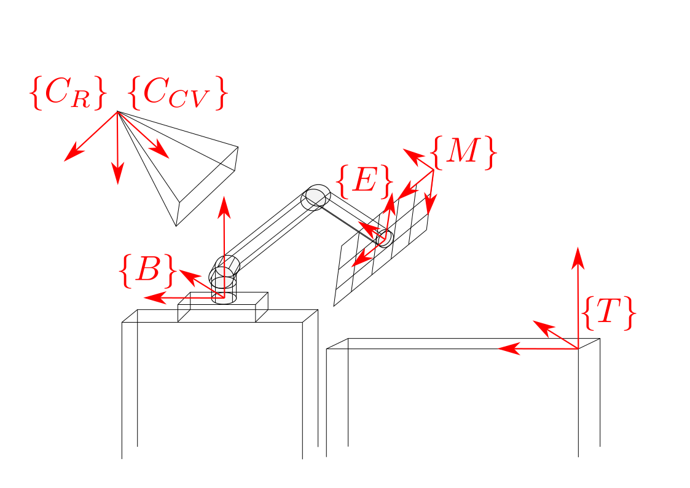

# Mutli-Camera - UR5 Robotic Arm Calibration Package


## Package Overview
This software package demonstrates a calibration strategy for
multi-cameras with respect to the manipulator's base frame.
This repository contains the main calibration script, required hardware CAD files,
and a data collection example script.

This software is designed for UR5 manipulator, however the overall
calibration strategy is general and other robotic or camera platforms can be integrated
if the robot forward kinematics is provided.

## Prequisites
This repository is tested under python 2.7. 
If the dataset is provided with the given  file structure,
 the calibration can be executed without ROS. However, running the data 
 collection example does require ROS. 

*The data collection script is tested on ur5 with firmware 13.xx*

ChAruco calibration boards can be generated [here][board].

## File Structure
```
./dataset
+-- dataset1
|  +-- out.json
|  +-- cam_0
|  |  +-- images
|  |  |  +-- 000.png
|  |  |  +-- ...
|  |  +-- meta
|  |  |  +-- 000.json
|  |  |  +-- ...
|  |  +-- table*
|  |  |  +-- images
|  |  |  |  +-- ...
|  |  |  +-- meta
|  |  |  |  +-- ...
|  +-- cam_1
... 
```
The calibration script scans the sub-directories in a given dataset, each sub-directory
contains the sample associated with one camera, including a `images` and a `meta` folder.
The `*.json` file for each sample has the
joint angle of the manipulator and corresponding image name. The `table` folder is optional, 
it uses the calibration parameter associated with the directory it is in to estimate the 
table surface height w.r.t the manipulator's base frame.

## Run the program
Type `python run.py -h` for detailed description of the optional arguments.

## Implementation
The code is designed to calibrate the setup shown below.


where {C_CV} refers to camera pose using the Computer Vision convention, {C_R} refers to camera pose using the Robotics convention, {M} refers to the ChAruco Marker board, {E} refers to end-effector pose, {B} refers to the pose of the UR5 base, and {T} refers to the pose of the table.

The code computes the poses the pose of the camera, table, and end-effector with respect to the base of the UR5. The pose of the table is defined as being the pose of the calibration board when the board is sitting flat on the table. Thus, only the axis orthogonal to the table will remain constant as the checkerboard moves around the plane of the table.

A more detailed overview of the calibration process is provided in `documents/formulation.pdf`.

[cv]: https://opencv.org/ "OpenCV"
[ros]: http://wiki.ros.org/ur_kin_py "ur_kin_py"
[zed]: https://github.com/stereolabs/zed-ros-wrapper "zed"
[pg]: http://wiki.ros.org/pointgrey_camera_driver "pointgrey"
[board]: https://calib.io/pages/camera-calibration-pattern-generator "calib.io"

